# Project Management 

Administrador de tareas en laravel

**power by Laravel 5.8**

# Instalación del proyecto.
## 1. Descargar el proyecto.
Debemos de ir a la página: https://github.com/alejandropb36/project-management, y descargar el proyecto en .zip.
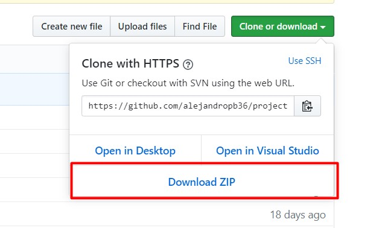

## 2. Descomprimir el proyecto en la carpeta publica de tu web-server.
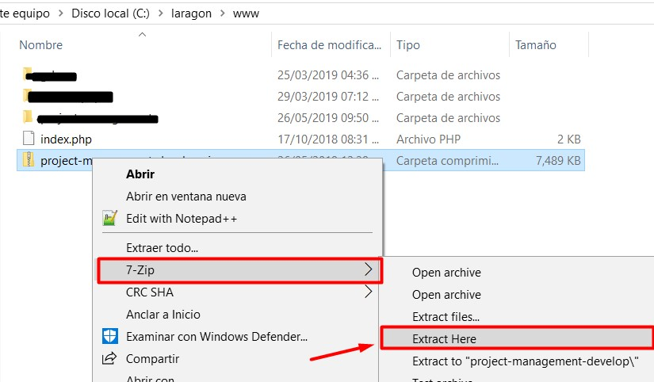
Se nos generara una nueva carpeta.

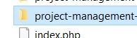

## 3. Abrir una terminal en la ruta de la nueva carpeta.
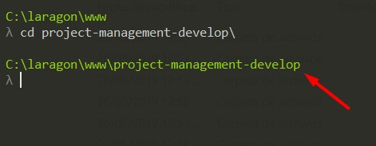

## 4. Crear el archivo de configuración del proyecto (.env)

Dentro de la terminal corremos el siguiente comando.
    
    cp .env.example .env

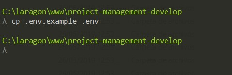

## 5. Crear la base de datos del proyecto.

Hay que crear la base de datos, nosotros recomendams Mysql o MariaDB.

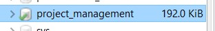

## 6. Configurar el archivo .env

Hay que abrir el archivo .env con el editor de codigo de tu preferencia y configurar las conexiones de la base de datos y servidor de correo.

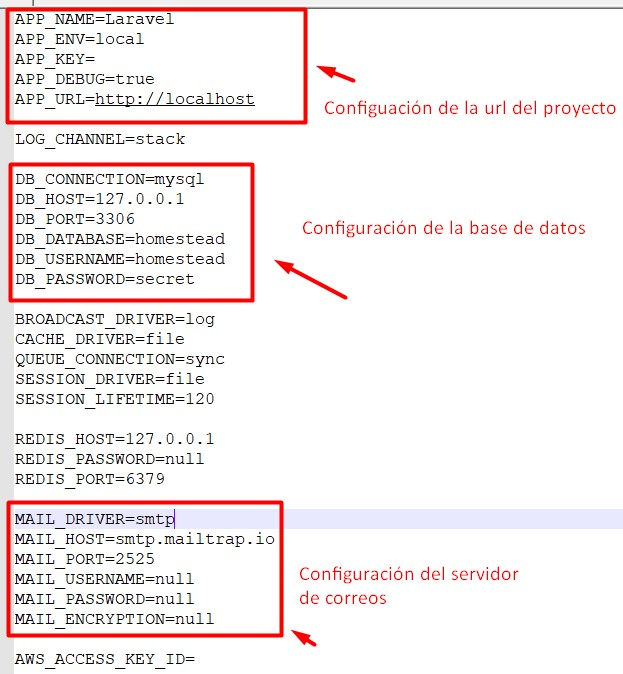

## 7. Instalar el proyecto.

Para instalar se utiliza el siguiente comando desde la termial.

    composer install

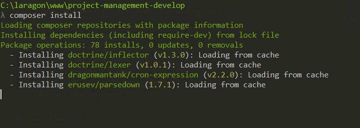

Hay que esperar hasta que termine el proceso.

Una vez terminado tenemos que generar la llave del proyecto, para eso ejecutamos: 

    php artisan key:generate

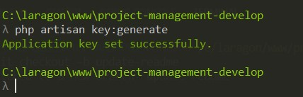

## 8. Hacer la migración de la base datos.

Para hacer la migración primero debe ejecutar el siguiente comando.

    php artisan migration

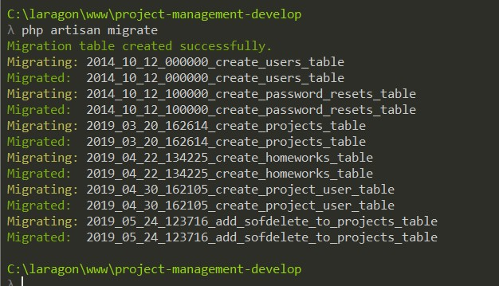

Ejecutamos el comando:

    composer dump-autoload

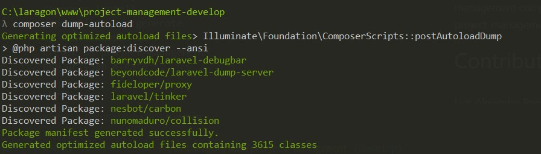

Esto nos servira pra no tener problemas son los Seeders.

Despues generamos el usuario Admin, para eso corremos el siguiente comando:

    php artisan db:seed --class=AdminUserSeeder

El usuairio Admin es:

email: admin@admin.com

password: admin123

Si queremos Generar unos datos de prueba, debemos ejecutare el siguiente comando:

    php artisan db:seed

## 9. Probar el sistema :)

Ingresamos a nuestro navegador a la ruta del proyecto, en este caso yo genere un virtual host para mas facil acceso.

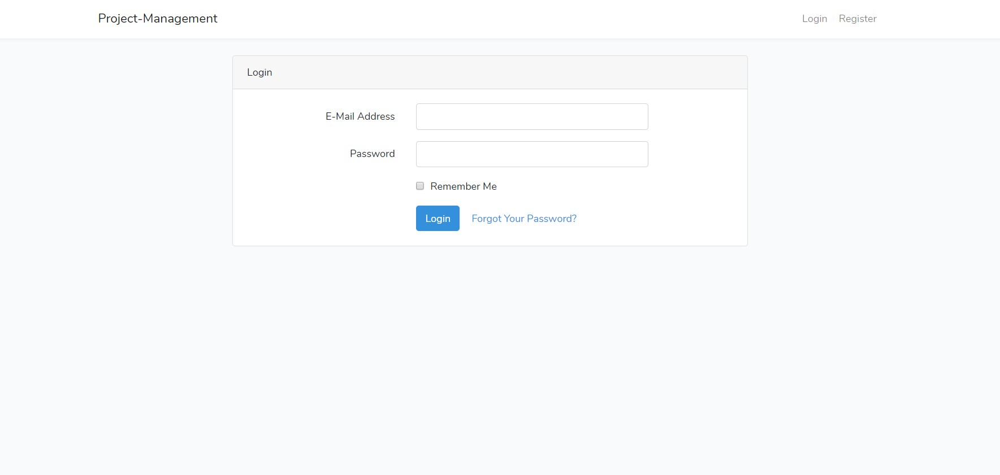

# Team

Luis Alejandro Ponce Brizuela.

[GitHub: @alejandropb36](http://github.com/alejandropb36)

Kevin Isrrael Molina Villanueva.

[GitHub: @molinak97](http://github.com/molinak97)

# License

MIT